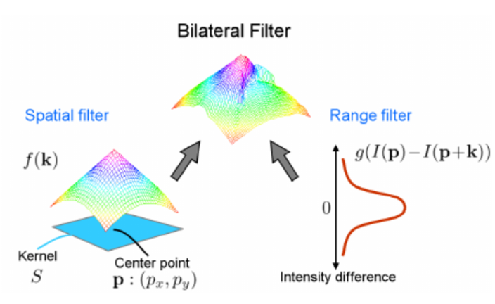

# CUDA Bilateral Filter

This project implements a bilateral filter using CUDA for efficient image processing. The bilateral filter is used to smooth images while preserving edges, which is particularly useful in various image processing and computer vision applications.



## Table of Contents

- [Overview](#overview)
- [Features](#features)
- [Installation](#installation)
- [Building](#building)
- [Project Structure](#project-structure)
- [Running](#running)
- [Testing](#testing)
- [Optimization Details](#optimization-details)
- [Profiling and Performance](#profiling-and-performance)

## Overview

The bilateral filter is a non-linear, edge-preserving, and noise-reducing smoothing filter for images. It replaces the intensity of each pixel with a weighted average of intensity values from nearby pixels. This project leverages the parallel processing power of CUDA to implement an efficient bilateral filter.

## Features

- **CUDA Implementation**: Leverages GPU for high-performance image processing.
- **Global and Shared Memory Modes**: Supports both global memory and shared memory optimizations.
- **Pipeline for Multiple Filters**: Implements a flexible pipeline for applying multiple filters sequentially.
- **Unit Testing**: Includes a comprehensive test suite using Catch2.
- **Profiling and Performance Analysis**: Utilizes NVIDIA tools like `nvprof` and `nvvp` for profiling.

## Installation

### Prerequisites

- CUDA Toolkit
- CMake
- Catch2 (for testing)
- A C++20 compatible compiler (e.g., GCC, Clang)
- Conan for dependency management
```sh
pip install conan
```

### Clone the Repository

```sh
git clone https://github.com/your-username/Cuda-BilateralFilter.git
cd Cuda-BilateralFilter
```

##Building

After cloning the repository, first install the missing dependencies
```sh
conan install . --build=missing
```

To build the project,

```sh
mkdir build
cd build
cmake .. -DCMAKE_BUILD_TYPE=Release
```


